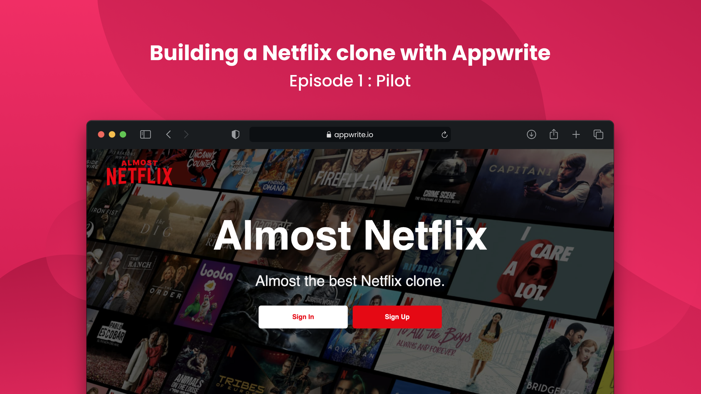

# Almost Netflix - Web (Next.js Port)

[Nuxt.js version](https://github.com/appwrite/demo-almost-netflix-for-web)



## Requirements

Before using this project, you will need to have Appwrite instance with Almost Netflix project ready. You can visit Project setup [GitHub repository](https://github.com/Meldiron/almost-netflix-project-setup) or [Dev.to post](https://dev.to/appwrite/did-we-just-build-a-netflix-clone-with-appwrite-28ok).

## Changes & Additions with Porting
Added "Who's watching ?" screen, click profile photo when login (only basic functionality), improved error messages for auth. Some UI & bug fixes and added some new bugs maybe ? :) (**ported in 1 day**)

## Usage

Rename .env.local.example to .env.local and update environment variables.


```bash
$ git clone https://github.com/sinanbekar/demo-almost-netflix-for-web-next.git
$ cd demo-almost-netflix-for-web-next
$ yarn install
$ yarn dev
```

The application will be listening on port `3000`. You can visit in on URL `http://localhost:3000`.

## Build Setup

```bash
# install dependencies
$ yarn install

# serve with hot reload at localhost:3000
$ yarn dev

# build for production and launch server
$ yarn build
$ yarn start
```
